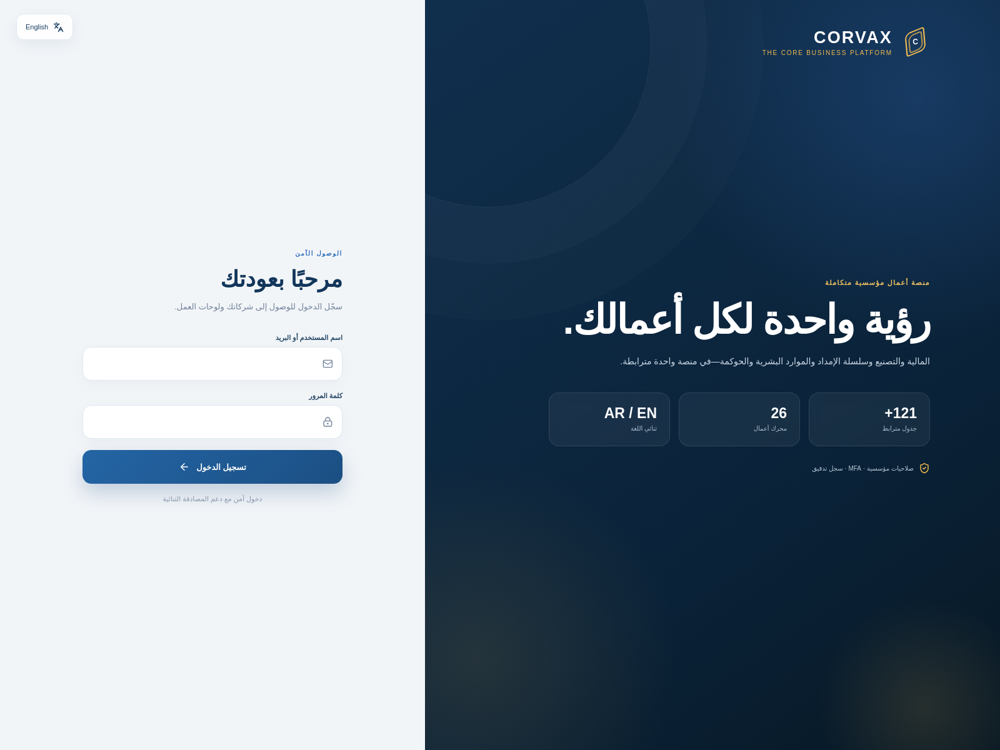
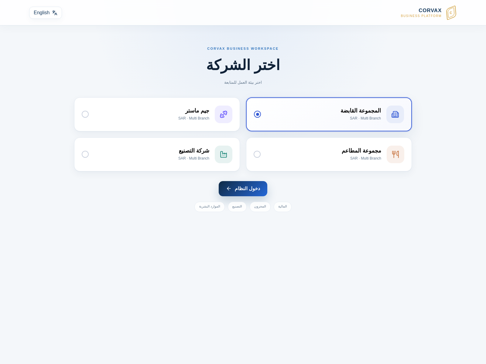
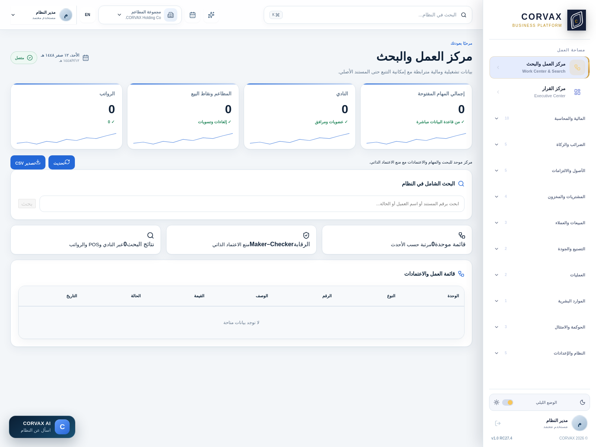
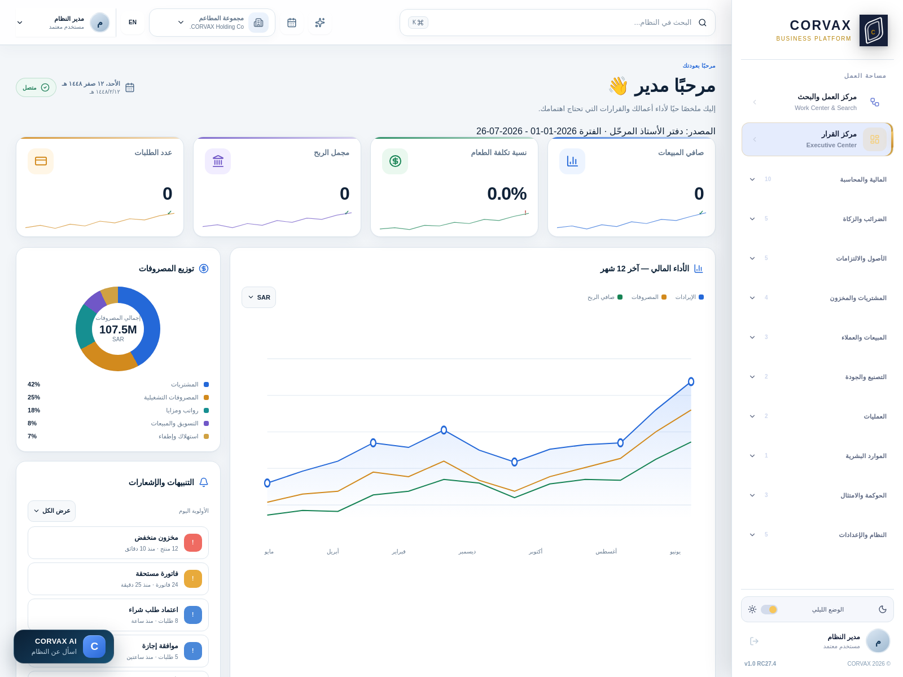

# دليل استخدام CORVAX — الدفعة ١

**الدخول · اختيار الشركة · مركز العمل والبحث · مركز القرار**

> هذا الدليل مكتوب على نظام يعمل فعلًا، والصور ملتقطة من شاشات حقيقية لا من تصميم.
> كل رقم افتراضي مذكور هنا مأخوذ من الكود مباشرة.

---

## ١) شاشة الدخول

### الحقول

| الحقل | ماذا تكتب | ملاحظة |
|-------|-----------|--------|
| **اسم المستخدم أو البريد** | `admin` أو `admin@corvaxplatform.com` | يقبل الاثنين |
| **كلمة المرور** | كلمتك | لا حد أدنى عند الدخول |

### الافتراضيات المهمة

**لماذا يقبل الحقل اسمًا وبريدًا معًا؟**
لأن موظفيك لن يحفظوا بريدًا لكل واحد. تعطيهم اسمًا قصيرًا (`ahmed`، `sara`) فيدخلون به. والبريد يبقى للحسابات القديمة.

**كم مرة يمكن أن أخطئ في كلمة المرور؟**
**خمس محاولات**، ثم يُقفل الحساب **١٥ دقيقة**. هذا يمنع تخمين كلمات المرور آليًا.

**مدة الجلسة؟**
**١٥ دقيقة** من عدم النشاط، والتجديد التلقائي يعمل حتى **٧ أيام**. أي أنك لن تُخرَج فجأة وأنت تعمل، لكن جهازًا متروكًا يُقفل نفسه.

**إن ظهر لي طلب "تغيير كلمة المرور"؟**
هذا مقصود. كلمتك الحالية **مؤقتة** — أعطاها لك المدير أو أُنشئت عند تثبيت النظام. لن تصل لأي شاشة قبل أن تضع كلمة خاصة بك (١٢ حرفًا فأكثر) لا يعرفها أحد.

**إن طُلب مني رمز من الجوال؟**
حسابك من الأدوار الحساسة والمصادقة الثنائية مفروضة عليه. ستظهر لك صورة QR تمسحها بتطبيق **Microsoft Authenticator** أو **Google Authenticator** مرة واحدة، ثم يعطيك التطبيق رمزًا متغيّرًا كل ٣٠ ثانية.

---

## ٢) اختيار الشركة

بعد الدخول تظهر الشركات المصرَّح لك بها. النظام **متعدد الشركات** بالتصميم.

### الشركات في النسخة التجريبية

| # | الشركة | نوعها | ماذا يظهر فيها |
|---|--------|-------|-----------------|
| ١ | المجموعة القابضة | `holding` | **كل الأقسام** — للتوحيد والإشراف |
| ٢ | جيم ماستر | `gym` | يظهر قسم النادي |
| ٣ | مجموعة المطاعم | `restaurant` | يظهر المطاعم ونقاط البيع |
| ٤ | شركة التصنيع | `manufacturing` | يظهر التصنيع والتكاليف |

### الافتراضيات المهمة

**لماذا تختلف القائمة الجانبية بين شركة وأخرى؟**
لأن كل شركة لها **نطاق** (`scope`). قسم "إدارة النادي" لا معنى له في شركة التصنيع، فلا يظهر أصلًا. هذا ليس نقصًا بل تصميم مقصود يمنع الفوضى.

> **ولهذا** إن لم تجد قسمًا تتوقعه، **تأكد أولًا من الشركة المختارة**. أغلب بلاغات "القسم مفقود" سببها هذا.

**هل يمكن التنقل بين الشركات بلا خروج؟**
نعم — من القائمة المنسدلة أعلى الشاشة بجوار اسم الشركة.

**ما الذي يُعزَل بين الشركات؟**
**كل شيء**: الحسابات، القيود، الفواتير، المخزون، الموظفون. لا تسريب بينها. وحدها القابضة ترى تقارير التوحيد.

**ماذا لو ظهرت رسالة "تعذّر تحميل الشركات"؟**
معناها فشل الاتصال بالخادم. **سجّل خروجًا ودخولًا** — ولن يعرض النظام شركات وهمية كما كان يفعل سابقًا (كان عيبًا أُصلح).

---

## ٣) مركز العمل والبحث

هذا **مدخلك اليومي**. يجمع ما ينتظر قرارك من كل الأقسام في مكان واحد.

### القسم الأول: قائمة العمل

كل صف بند ينتظر إجراءً منك:

| النوع | مصدره | ما تفعله |
|-------|-------|----------|
| فاتورة مستحقة | المشتريات | تدفع أو تؤجّل |
| اعتماد طلب شراء | المشتريات | توافق أو ترفض |
| موافقة إجازة | الموارد البشرية | توافق أو ترفض |
| تأكيد مالي جاهز | الإقفال المالي | تراجع وتعتمد |
| مخزون منخفض | المخزون | تطلب شراء |

**الترتيب افتراضيًا حسب الأولوية**، والأحدث أولًا داخل كل مستوى.

### القسم الثاني: البحث الشامل

**شريط البحث في أعلى الشاشة** (وليس داخل الصفحة) يبحث في النظام كله.

**كيف تستخدمه:**
1. اكتب **حرفين على الأقل** — أقل من ذلك لن يبحث
2. اضغط `Enter`
3. ينقلك لمركز العمل ويعرض النتائج

**اختصار لوحة المفاتيح:** `Ctrl + K` يقفز للبحث مباشرة من أي شاشة.

**ماذا يبحث فيه؟**
الفواتير، القيود، العملاء، الموردين، الأصناف، الموظفين، الأصول — بالرقم أو الاسم أو المرجع.

> **ملاحظة تقنية:** كان البحث معطّلًا في النسخ السابقة — تكتب وتضغط Enter فينقلك لصفحة فارغة. السبب أن الصفحة لم تكن تقرأ كلمة البحث من الرابط. **أُصلح**، وصار يبحث تلقائيًا فور وصولك.

### الافتراضيات المهمة

**هل ترى قائمة العمل بنود كل الشركة أم فرعي فقط؟**
حسب صلاحيتك. لو حسابك مقيّد بفرع، ترى بنود فرعك فقط.

**كم بندًا يعرض؟**
الحد الأقصى **٢٠٠ بند** لكل نوع، للحفاظ على السرعة.

---

## ٤) مركز القرار (الشاشة الرئيسية)

لوحتك التنفيذية. تفتح تلقائيًا بعد اختيار الشركة.

### البطاقات الأربع العليا

| البطاقة | مصدرها | معناها |
|---------|--------|--------|
| **إجمالي الإيرادات** | حسابات `4xxxxx` | مبيعات الفترة |
| **صافي الربح** | الإيرادات − المصروفات | نتيجة الفترة |
| **إجمالي الأصول** | حسابات `1xxxxx` | ما تملكه |
| **النقد والرصيد البنكي** | الحسابات المعلَّمة `is_cash` | سيولتك الفعلية |

> **مهم:** الأرقام من **دفتر الأستاذ المرحَّل** — لا تقديرات. المصدر مكتوب تحت العنوان مع الفترة بالضبط.

### الرسم البياني: الأداء المالي — آخر ١٢ شهرًا

ثلاثة خطوط: **الإيرادات** (أزرق) · **المصروفات** (برتقالي) · **صافي الربح** (أخضر).

**اقرأه هكذا:** لو اقترب الأزرق من البرتقالي، هامشك يتآكل. ولو تقاطعا، أنت تخسر.

### توزيع المصروفات

دائرة بالنِسَب. في المثال:
`المشتريات ٤٢٪ · التشغيلية ٢٥٪ · رواتب ١٨٪ · تسويق ٨٪ · استهلاك ٧٪`

**استخدامها:** لو قفزت نسبة المشتريات فجأة، إما ارتفعت الأسعار أو هناك هدر.

### التنبيهات والإشعارات

بنود عاجلة مع **زمن حدوثها** ("منذ ١٠ دقائق"). الأحمر أعجل من البرتقالي.

### الوصول السريع

ثمانية أزرار للأكثر استخدامًا:
`دفعة · طلب شراء · فاتورة بيع · قيد يومية · لوحة تنفيذي · ميزان المراجعة · تقرير الربح · إقفال فترة`

### الأشرطة السفلية

| المؤشر | معناه |
|--------|-------|
| **جودة البيانات ٩٨٪** | نسبة السجلات المكتملة |
| **الامتثال والضوابط ٩٦٪** | الضوابط المفعّلة |
| **المخاطر المفتوحة ٨** | مخاطر مسجّلة بلا معالجة |
| **الملاحظات العالية ٣** | ملاحظات مراجعة تحتاج ردًا |

### الافتراضيات المهمة

**ما الفترة الافتراضية؟**
من **١ يناير للسنة الحالية** حتى **اليوم**. مكتوبة تحت العنوان دائمًا — لا تخمّن.

**لماذا الأرقام صفر عندي؟**
لأنك لم تُدخل بيانات بعد، أو الشركة المختارة فارغة. **جرّب المجموعة القابضة**.

**هل تتحدث لحظيًا؟**
تُحسب عند فتح الصفحة. للتحديث أعد تحميلها.

**العملة؟**
**الريال السعودي (SAR)** افتراضيًا، ويظهر مُبدِّل في الرسم البياني.

---

## ٥) الأيقونات في الشريط العلوي

من اليمين لليسار في الواجهة العربية:

| الأيقونة | الوظيفة |
|----------|---------|
| **اسم المستخدم** | حسابك ودورك |
| **EN / AR** | تبديل اللغة فورًا |
| **اسم الشركة** | التنقل بين شركاتك |
| **📅 التقويم** | **بلا وظيفة حاليًا** |
| **✨ المفضلة** | **بلا وظيفة حاليًا** |
| **🔍 البحث** | البحث الشامل (`Ctrl+K`) |

> **مصارحة:** أيقونتا التقويم والمفضلة **زخرفيتان** ولا تفعلان شيئًا. سنحذفهما أو نربطهما بوظيفة حقيقية.

---

## ٦) الشريط الجانبي — التنقّل

### البنية

**في الأعلى بلا مجموعة:** مركز العمل والبحث · مركز القرار — نقطتا دخولك اليوميتان.

**ثم عشر مجموعات مطوية:**

| المجموعة | الأقسام | اللون |
|---------|---------|-------|
| المالية والمحاسبة | ١٠ | أزرق |
| الضرائب والزكاة | ٥ | ذهبي |
| الأصول والالتزامات | ٥ | بنفسجي |
| المشتريات والمخزون | ٤ | أخضر مزرقّ |
| المبيعات والعملاء | ٣ | أخضر |
| التصنيع والجودة | ٣ | برتقالي |
| العمليات | ٣ | أحمر |
| الموارد البشرية | ١ | سماوي |
| الحوكمة والامتثال | ٣ | رمادي |
| النظام والإعدادات | ٥ | بنفسجي فاتح |

### الافتراضيات المهمة

**لماذا بعض المجموعات عددها أقل عندي؟**
لأنك في شركة ذات نطاق محدد. "المبيعات والعملاء" تعرض `2` في شركة التصنيع لأن قسم المطاعم لا يخصها.

**هل تُفتح المجموعة تلقائيًا؟**
نعم — **إن كانت تحوي القسم المفتوح حاليًا**. فلن تصل لرابط مباشر وتجد الشريط مطويًا.

**لماذا لا أرى قسمًا يراه زميلي؟**
القائمة **تراعي صلاحياتك**. لا ترى ما لا تملك صلاحيته — بدل أن تراه وتُصدم بـ"ممنوع الوصول".

**الوضع الليلي والنهاري؟**
المفتاح أسفل الشريط. النهاري شريط أبيض بنص أسود، والليلي كحلي بنص فاتح. **والأيقونات ملوّنة في الوضعين** لتميّز المجموعات بلمحة.

---

## ما القادم

**الدفعة ٢:** المالية والمحاسبة — بناء شجرة حسابات من خمسة مستويات بمثال مصنعك، والمركز المالي بمستوياته (رئيسية ← فرعية ← تفصيلية)، وقيود اليومية، والخزينة، والإقفال.
