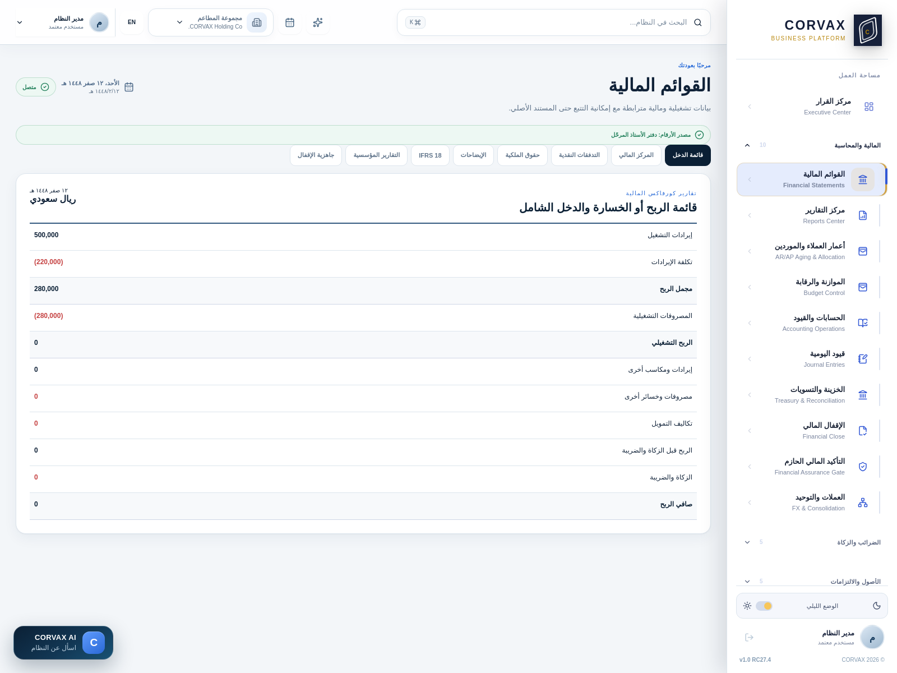
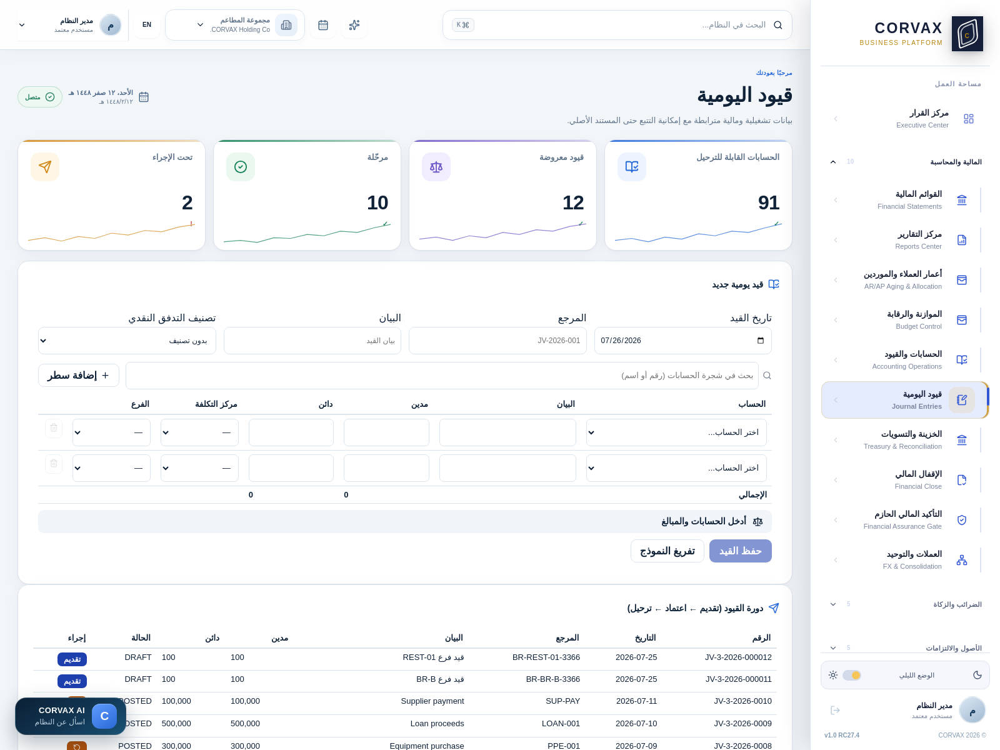
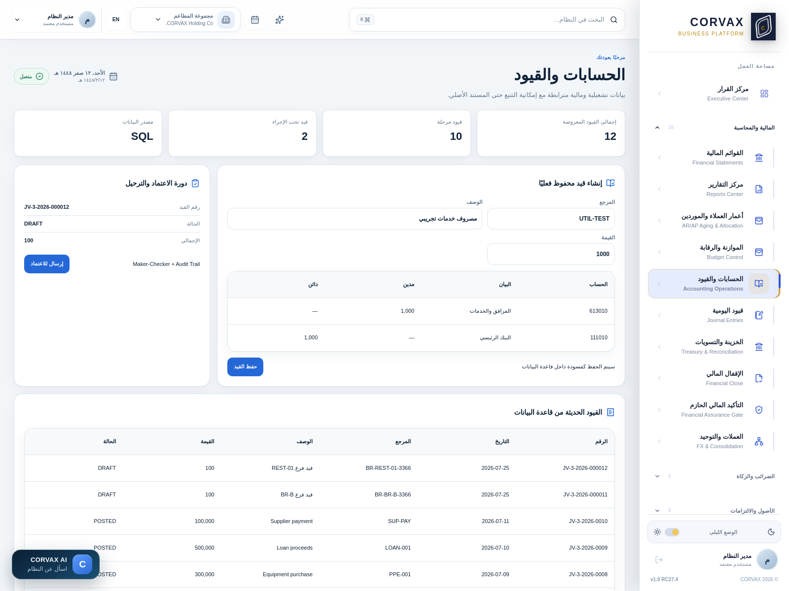
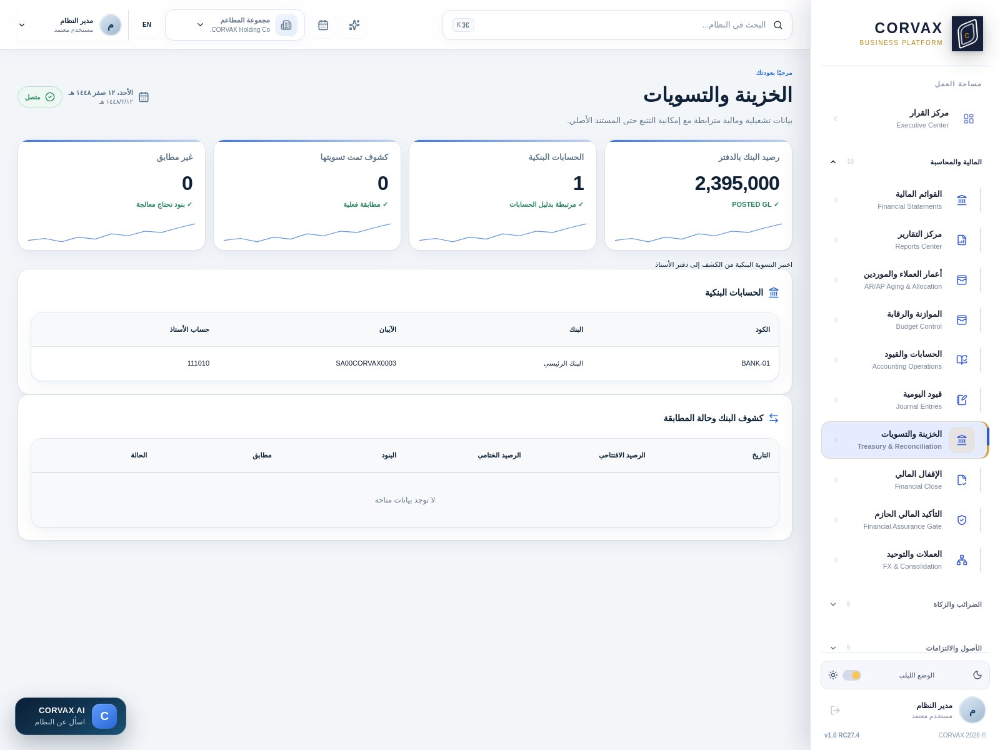
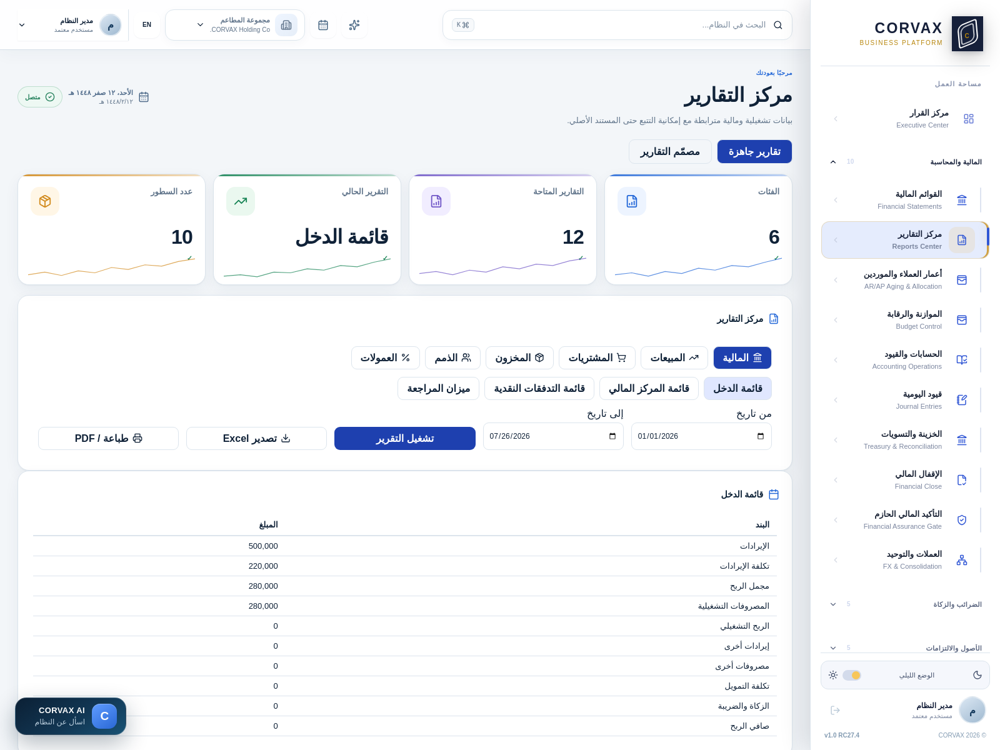
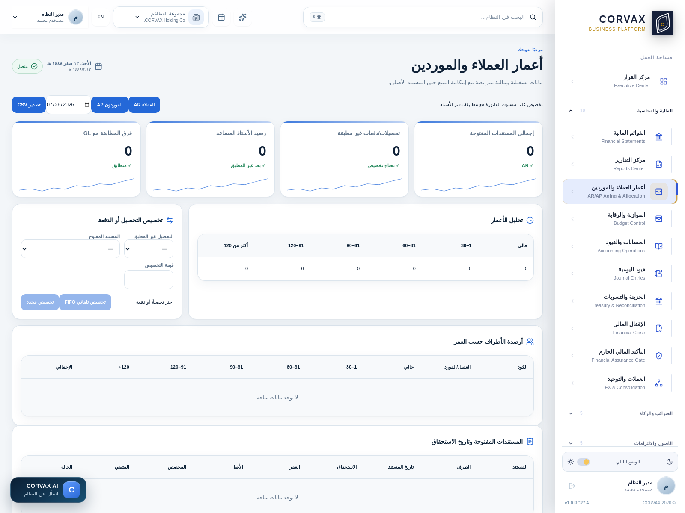
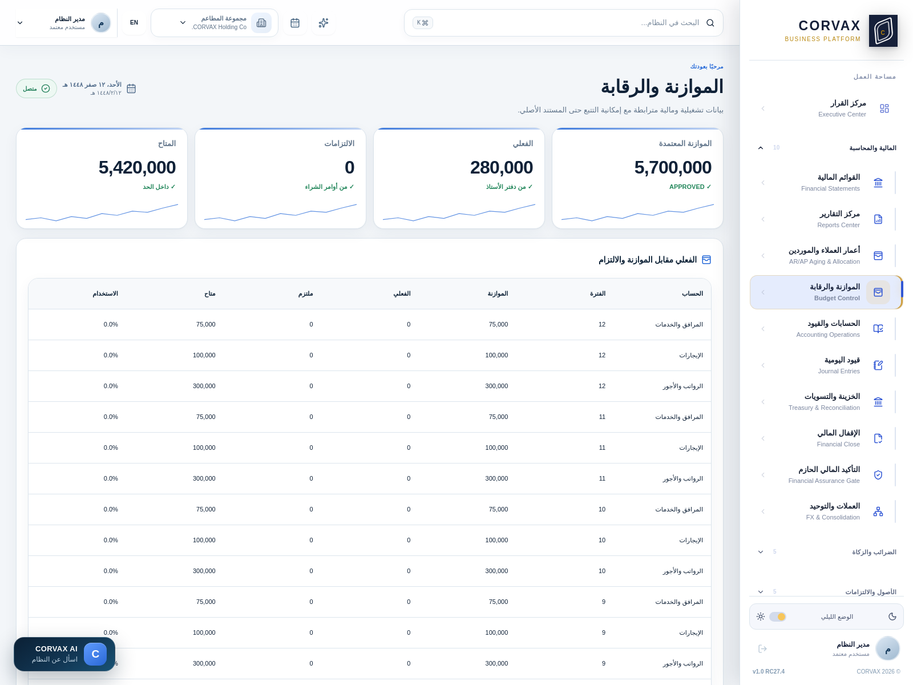
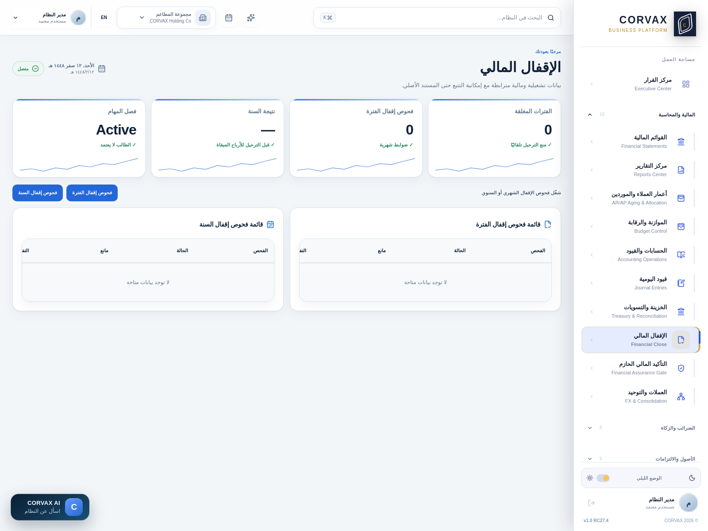

# دليل استخدام CORVAX — الدفعة ٢

## المالية والمحاسبة (١٠ أقسام)

> أكبر مجموعة في النظام وأهمها لك. كل رقم هنا مأخوذ من الكود أو من تشغيل فعلي.

---

# أولًا: شجرة الحسابات — الأساس الذي يقوم عليه كل شيء

## ما لديك الآن

عند تثبيت النظام تُبنى شجرة جاهزة بـ**١٠٣ حسابات في ثلاثة مستويات**:

| المستوى | العدد | يقبل الترحيل؟ | المعنى |
|---------|-------|---------------|--------|
| **١** | ٨ | ✗ لا | المجموعات الكبرى |
| **٢** | ٥٧ | ✓ نعم | المجموعات الفرعية |
| **٣** | ٣٨ | ✓ نعم | الحسابات التفصيلية |

**المجموعات الثماني الرئيسية:**

```
100000  الأصول
200000  الالتزامات
300000  حقوق الملكية
400000  الإيرادات
500000  تكلفة الإيرادات
600000  المصروفات التشغيلية
700000  إيرادات ومصروفات أخرى
800000  الزكاة والضريبة
```

## قاعدة الترقيم المستخدمة

```
1   1   3   0   1   0
│   │   │   └───┴───┴── تسلسل الحساب داخل مجموعته
│   │   └────────────── المجموعة الفرعية
│   └────────────────── التصنيف
└────────────────────── المجموعة الرئيسية (1=أصول، 2=التزامات...)
```

**مثال حقيقي:**
```
100000  الأصول                    ← مستوى ١
  110000  الأصول المتداولة        ← مستوى ٢
    111010  البنك الرئيسي         ← مستوى ٣ (يقبل الترحيل)
    112010  العملاء               ← مستوى ٣
    113010  المخزون               ← مستوى ٣
  150000  الأصول غير المتداولة    ← مستوى ٢
    151010  الممتلكات والمعدات    ← مستوى ٣
    155010  مشروعات تحت التنفيذ   ← مستوى ٣
```

---

## بناء شجرة من خمسة مستويات — مثال مصنعك

طلبت خمسة مستويات. **هذا مثال منفّذ ومختبَر فعليًا** على مصروفات خط الدواجن:

```
L1  600000  المصروفات التشغيلية        [رئيسي — لا يقبل الترحيل]
    L2  630000  مصروفات التصنيع        [رئيسي]
        L3  631000  مصروفات خط الدواجن  [رئيسي]
            L4  631100  تكاليف التبريد   [رئيسي]
                L5  631110  كهرباء غرف التبريد  [✓ يقبل الترحيل]
```

### كيف تبنيه — خطوة بخطوة

**الخطوة ١: اختر رقمًا داخل نطاق الأب**

القاعدة: **رقم الابن يبدأ بالبادئة المعنوية للأب** — أي رقم الأب بعد إزالة الأصفار الأخيرة.

| الأب | بادئته | أرقام صحيحة للابن |
|------|--------|-------------------|
| `600000` | `6` | `610000` · `630000` · `690000` |
| `630000` | `63` | `631000` · `632000` |
| `631000` | `631` | `631100` · `631200` |
| `631100` | `6311` | `631110` · `631120` |

> **لو أخطأت** يرفض النظام ويخبرك بالبادئة المطلوبة ويقترح مثالًا صحيحًا.

**الخطوة ٢: أنشئ الحساب**

تحتاج: **رقم الحساب** · **الاسم بالعربي** · **الاسم بالإنجليزي** · **رقم الحساب الأب**

**ولا تحتاج** تحديد نوع الحساب — **يُورَث من الأب تلقائيًا**.

---

## الضوابط المحاسبية — اقرأها بعناية

### ١) الأب لا يقبل الترحيل

بمجرد أن تُنشئ حسابًا تحت حساب آخر، **يتحوّل الأب تلقائيًا إلى "رئيسي"** ويتوقف عن قبول القيود.

**السبب المحاسبي:** المجموع لا يحمل حركاته الخاصة. لو قبل `631100` قيودًا وقبلها أبناؤه أيضًا، فرصيده سيكون **مزيجًا من مجموع أبنائه وحركاته الخاصة** — ولا تعرف أيهما.

**رسالة النظام:**
> *"تم إنشاء الحساب في المستوى ٤. وتحوّل الحساب 631000 إلى حساب رئيسي لا يقبل الترحيل."*

### ٢) حساب عليه قيود لا يصير أبًا

**جرّبته على المخزون `113010` (وعليه قيود مرحّلة) فرفض:**

> *"الحساب 113010 عليه حركات مرحّلة، فلا يمكن جعله حسابًا رئيسيًا. انقل حركاته أولًا أو أنشئ الحساب تحت أب آخر."*

**لماذا هذا صواب:** لو سمح، لأصبح لديك حساب رئيسي يحمل حركات — والأرصدة التاريخية تختلط.

**ما تفعله:** أنشئ الأبناء بأرقام جديدة، ثم انقل الأرصدة بقيد تسوية، ثم أنشئ الشجرة.

### ٣) الابن يرث نوع الأب

لا تستطيع وضع حساب التزام تحت الأصول. النوع ومجموعة القائمة **يُنسخان من الأب إلزاميًا**.

### ٤) حساب عليه قيود لا يُحذف — يُعطَّل فقط

> *"الحساب 613010 عليه ١٤ سطر قيد، فلا يُحذف. عطّله بدلًا من ذلك."*

**السبب:** حذفه يفسد القيود التاريخية والقوائم المالية للسنوات السابقة.

**التعطيل** يمنع الاستخدام الجديد ويحفظ التاريخ.

### ٥) لا تعطّل أبًا له أبناء نشطون

> *"لا يمكن تعطيل 631000 لأن تحته ٣ حسابات نشطة. عطّلها أولًا."*

---

## توصيتي لمصنعك — كم مستوى تحتاج فعلًا؟

**رأيي كمستشار: ثلاثة إلى أربعة مستويات تكفي، والخمسة للتفاصيل الحرجة فقط.**

**السبب:** كل مستوى إضافي يعني قيودًا أكثر تفصيلًا ووقتًا أطول من محاسبك. الخمسة مستويات مفيدة حين تريد **تكلفة خط إنتاج بعينه**، لا لكل شيء.

**اقتراح عملي لخطوط الدواجن:**

```
500000  تكلفة الإيرادات
  510000  تكلفة المواد الخام
    511000  دواجن
      511100  دجاج كامل
      511200  أجزاء
    512000  توابل ومضافات
    513000  تغليف
  520000  تكلفة العمالة المباشرة
  530000  تكاليف صناعية غير مباشرة
    531000  كهرباء التبريد
    532000  صيانة الخطوط
    533000  إهلاك المعدات
```

**أربعة مستويات**، وتعطيك تكلفة كل منتج بدقة.

---

# ثانيًا: القوائم المالية



## المركز المالي بمستوياته — سؤالك الثاني

طلبت أن ترى الحسابات **الرئيسية**، ثم **الفرعية**، ثم **الكاملة**. النظام يعرضها هكذا:

### المستوى الأول: الرئيسية (المجموعات)

```
الأصول                    ٢٧٧٥٠٠٠
الالتزامات                ١٨٩٥٠٠٠
حقوق الملكية               ٨٨٠٠٠٠
```

**هذا ما يراه المدير** — صورة كلية في ثلاثة أسطر.

### المستوى الثاني: الفرعية

```
الأصول
  الأصول المتداولة        ٢٣٩٥٠٠٠
  الأصول غير المتداولة     ٣٨٠٠٠٠
```

**هذا ما يراه المدير المالي** — أين تتركّز الأصول.

### المستوى الثالث: التفصيلية

```
الأصول المتداولة
  البنك الرئيسي           ٢٣٨٣٧٠٠
  العملاء                   ١١٣٠٠
  المخزون                        ٠
```

**هذا ما يراه المحاسب** — الأرصدة الفعلية القابلة للمطابقة.

### الافتراضيات المهمة

**هل الميزانية متوازنة دائمًا؟**
نعم — والنظام يعرض علامة `balanced: true`. لو ظهرت `false` فهناك خلل يجب إيقاف العمل لحله.

**ما الفترة؟**
من **١ يناير** حتى **اليوم** افتراضيًا، وتستطيع تغييرها.

**القوائم الأربع المتاحة:**
قائمة المركز المالي · قائمة الدخل · التدفقات النقدية · التغيّرات في حقوق الملكية

**هل التدفقات النقدية مطابقة؟**
النظام يفحصها ويعرض `cash_reconciled`. المفترض أن الفرق صفر.

---

# ثالثًا: قيود اليومية



**هذه الشاشة أُعيد بناؤها بالكامل** — كانت تفرض حسابين ثابتين وسطرين وتاريخًا مجمّدًا.

## ما تحتاجه لتسجيل قيد

| الحقل | إلزامي | ملاحظة |
|-------|--------|--------|
| **تاريخ القيد** | ✓ | قابل للتغيير، افتراضه اليوم |
| **المرجع** | ✓ | رقمك أنت (`JV-2026-001`) |
| **البيان** | ✓ | وصف القيد |
| تصنيف التدفق النقدي | ✗ | تشغيلية / استثمارية / تمويلية |

**ولكل سطر:**

| الحقل | ملاحظة |
|-------|--------|
| **الحساب** | من قائمة بحث فيها **٩٦ حسابًا قابلًا للترحيل** |
| البيان | يورث بيان القيد إن تركته |
| **مدين / دائن** | **أحدهما فقط** لا الاثنان |
| مركز التكلفة | اختياري |
| الفرع | اختياري |

## الضوابط

**١) التوازن إلزامي**
مؤشر حيّ أسفل الجدول:
- **أخضر:** "القيد متوازن وجاهز للحفظ"
- **أحمر:** "القيد غير متوازن — الفرق ٥٠٠"
- **زر الحفظ معطّل** حتى يتوازن

**٢) السطر لا يحمل مدينًا ودائنًا معًا** — يُرفض.

**٣) الفترة المالية يجب أن تكون مفتوحة**
> *"Posting period is not open: FUTURE"* — لا ترحيل في فترة مستقبلية أو مقفلة.

**٤) فصل المهام**
المُعِدّ **لا يستطيع** اعتماد قيده. يجب شخص آخر.

## دورة القيد

```
مسوّدة → تقديم → اعتماد → مرحَّل → (عكس عند الحاجة)
```

**العكس لا يحذف** — ينشئ قيدًا مضادًا. الأصل يبقى في السجل.

## سطور غير محدودة

`+ إضافة سطر` بلا حد. مثال ثلاثي:
```
مدين   مصروف مشتريات   ١٠٠٠٠
مدين   ضريبة مدخلات     ١٥٠٠
دائن   المورد                  ١١٥٠٠
```

---

# رابعًا: الحسابات والقيود



شاشة عرض لدورة العمليات: الفواتير، السندات، ومطابقة الدفاتر الفرعية بالأستاذ العام.

**"مطابقة الدفاتر: Linked"** تعني أن أرصدة العملاء والموردين تطابق حسابات الأستاذ. لو ظهر غير ذلك فهناك خلل.

---

# خامسًا: الخزينة والتسويات



للمطابقة البنكية: تُدخل كشف البنك، ويطابقه النظام مع حركاتك، ويظهر الفروق.

**التاريخ الافتراضي** كان مجمّدًا وأُصلح.

---

# سادسًا: مركز التقارير



## تبويبان

### تقارير جاهزة — ١٢ تقريرًا في ٦ فئات

| الفئة | التقارير |
|-------|----------|
| مالية | قائمة الدخل · المركز المالي · التدفقات · ميزان المراجعة |
| مبيعات | الفواتير · التحصيل |
| مشتريات | الفواتير · السداد |
| مخزون | الأرصدة · الحركة |
| ذمم | أعمار العملاء · أعمار الموردين |
| عمولات | استحقاقات المندوبين |

**تختار الفترة → تشغيل → تصدير Excel أو PDF أو طباعة.**

### مصمّم التقارير

**١٥ مصدر بيانات** تبني منها تقريرك:
1. اختر المصدر
2. اختر الأعمدة
3. صفِّ (تاريخ أو نص)
4. جمِّع (عدد / مجموع / متوسط)
5. سمِّ وصدِّر

> **نصيحة:** للعربية استخدم **Excel** لا PDF — مكتبة PDF لا تدعم تشكيل الحروف العربية جيدًا.

---

# سابعًا: أعمار العملاء والموردين



تصنيف الذمم بالفترات: `0-30` · `31-60` · `60+` يومًا.

**مثال:**
```
الذمم المدينة  ٣٢٧٥٠٠٠
  ٠-٣٠ يوم    ١٨٢٠٠٠٠  (٥٥٪)
  ٣١-٦٠ يوم    ٨٧٥٠٠٠  (٢٧٪)
  ٦٠+ يوم      ٥٨٠٠٠٠  (١٨٪)
```

**اقرأه هكذا:** كل ريال في `60+` هو **خطر تحصيل**. لو زادت نسبته عن ١٥٪ فسياسة التحصيل تحتاج مراجعة.

---

# ثامنًا: الموازنة والرقابة



تُدخل موازنة لكل حساب أو مركز تكلفة، ويقارنها النظام بالفعلي ويعرض الانحراف.

> **ملاحظة صريحة:** الربط بمشروعات تحت التنفيذ **غير مكتمل** — لا تنبيه تلقائي عند تجاوز ميزانية المشروع.

---

# تاسعًا: الإقفال المالي



## الدورة

```
فتح الفترة → التشغيل → المراجعة → الإقفال → (إعادة الفتح باعتماد)
```

## عند الإقفال

- **لا ترحيل** في الفترة المقفلة
- تُحسب أرصدة الافتتاح للفترة التالية
- تُقفل حسابات الدخل في الأرباح المبقاة (عند إقفال السنة)

## قبل الإقفال — قائمة تحقق

| البند | القسم |
|-------|-------|
| ترحيل الإهلاك | الأصول الثابتة |
| إطفاء المصروفات المقدمة | المصروفات المقدمة |
| عكس الاستحقاقات المنتهية | الاستحقاقات |
| ترحيل جداول الإيجار | عقود الإيجار |
| مطابقة البنوك | الخزينة |
| مراجعة الأعمار | الأعمار |
| ميزان المراجعة متوازن | القوائم المالية |

---

# عاشرًا: التأكيد المالي والعملات

**التأكيد المالي الحازم:** بوابة تفحص الضوابط قبل السماح بالإقفال.

**العملات والتوحيد:** لتقييم الأرصدة بالعملات الأجنبية وتوحيد الشركات في القابضة.

---

## ما القادم

**الدفعة ٣:** الضرائب والزكاة (٥ أقسام) — الاستقطاع، الانتقائية، الزكاة وضريبة الدخل، الالتزام، الإشعارات الدائنة.

**والدفعة ٤:** المشتريات والمخزون — **وهنا سأتوقف لإصلاح دورة الشراء أولًا**، لأن فاتورة الشراء حاليًا لا تحرّك المخزون ولا تميّز الشراء المخزني من الخدمي ولا تعالج المعافى من الضريبة. **لن أوثّق عيبًا كأنه ميزة.**
